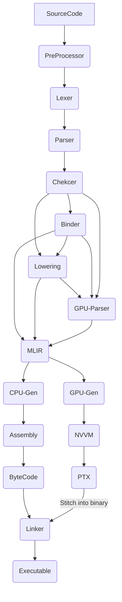

Typher Compiler

A memory-safe and GPU-compatible programming language that any C or C++ developer can jump into right away!

The fast compiled nature of C and C++ meets the simplicity of modern languages. Packed with a package manager, the Typher 
programming language allows you to write a single source code and run that code in the GPU and CPU with just one source file. 
No drivers or installation needed! It even has the same syntax. Just add the GPU flag before a function and it runs on the 
GPU just fine!

The Typher Compiler has many features similar to C++ without the feature-bloating of it. However compared to regular C and C++,
It's built for robotics programming and HPC. No large binary size, it can include regular C libraries and 
allows for custom types for unit programming like meters and seconds to avoid any unit miss-matches!

The language also provides memory safety rules but just like any modern systems they can be toggeled on and off with a keyword
for realtime and performance critical applications. Memory safety has layers so you can controll how much the compiler provides
safety for your own drawbacks. The main feature for memory safety is the borrow checker, which of course can be
toggled on or off on a given region.

The internal architecture uses an MLIR to seperate the GPU code from the CPU code after the parsing is completed. The
CPU part goes on as normal, it goes through an assembler, a byte code generator and finally linker. However the GPU
part is compiled seperately using PTX and the binary is stitched at the end of the binary code and everything
comes together at the linker phase.

Here is an example code:

```C
#include "some_clib.h"

@gpu(compute, device)
float calculate(float b, float n)
{
    return b * n; 
}

int :eax: get_first_member ()
{
    return 5;
}

int main() {
   float res = calculate<<<5, 6>>>(get_first_member(), 4);
   print("Hello everyone, here is the result: ", res);
}
```

Here is the diagram for it:



Right now only NVIDIA GPU's are supported. But I plan on adding all popular GPU providers like AMD and metal with a
similar low-level process.

This is a hobby project, I hope you enjoyed it. Feel free to contribute :)
